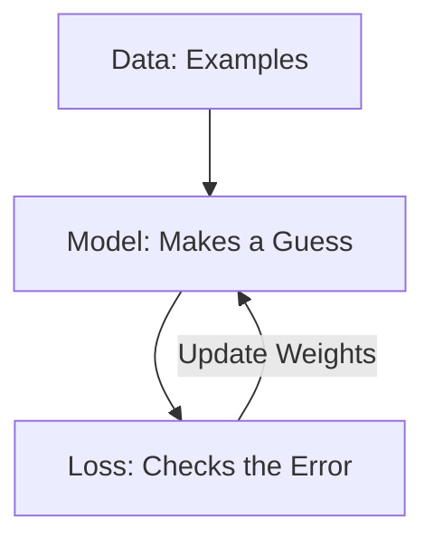

# The Three Pillars of Machine Learning

Every single Machine Learning system in the world, from the one that recognizes your face to the one that drives a car, is built on three main pillars. 

---

## Pillar 1: The Data ($D$)
Data is the "Experience." Just like you need to see many cats to know what a cat looks like, the computer needs many examples.

- **Quantity:** More data is usually better.
- **Quality:** If you show the computer bad examples (like pictures of dogs labeled as cats), it will learn the wrong things! (This is called **Garbage In, Garbage Out**).

---

## Pillar 2: The Model ($f(x, w)$)
The Model is the "Formula." It's the engine that takes the data and makes a guess.

The most famous simple model is the **Linear Model**:
$f(x) = w \cdot x + b$

- **$w$ (Weight):** Think of this as the "Importance." If $w$ is high, $x$ matters a lot.
- **$b$ (Bias):** Think of this as the "Starting Point."

---

## Pillar 3: The Loss Function ($L$)
The Loss is the "Scorecard." It tells the computer exactly how wrong it is.

> [!IMPORTANT]
> **The Goal of ML:** We want to find the weights ($w$) and bias ($b$) that make the **Loss as small as possible.** 
> This is called **Optimization**.

### How do we calculate Loss?
One common way is the **Squared Error**:
$L = (y - \hat{y})^2$

- If the real answer $y = 10$ and the guess $\hat{y} = 10$, then $Loss = (10 - 10)^2 = 0$. (Perfect!)
- If the real answer $y = 10$ and the guess $\hat{y} = 2$, then $Loss = (10 - 2)^2 = 64$. (Ouch! Big error!)

---

## Putting it all together: The Training Loop

1.  **Predict:** The model makes a guess ($\hat{y}$).
2.  **Calculate Loss:** See how far off the guess was from the truth ($y$).
3.  **Update:** Change the weights ($w$) a tiny bit to make the Loss smaller next time.
4.  **Repeat:** Do this thousands of times until the model stops making mistakes.

---

## Why Squared Error?
Why do we square the difference?
1.  **It removes negatives:** Whether you guess 5 too high or 5 too low, the error should be positive ($5^2 = 25$ and $(-5)^2 = 25$).
2.  **It punishes big mistakes:** Squaring a large number makes it huge! ($2^2 = 4$, but $10^2 = 100$). This forces the computer to focus on fixing the big errors first.
