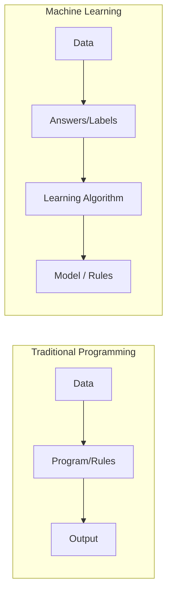

# What is Machine Learning?

> [!TIP]
> **Imagine you have a robot named Zog.** 
> Zog is very smart but doesn't know what an apple is. You could try to write a "Rule Book" for Zog:
> 1. If it's round...
> 2. And it's red...
> 3. And it has a stem...
> **THEN it is an apple.**
> 
> But what if the apple is green? Or what if it's sliced? Your rule book would fail! 
> **Machine Learning** is different. Instead of rules, you show Zog 1,000 pictures of apples. Zog looks at them and learns the "vibe" or the **pattern** of an apple by himself.

---

## The Core Definition

**Machine Learning (ML)** is a way of teaching computers to solve problems by looking at examples (data) rather than following a strict set of human-written instructions.

In the old way (**Traditional Programming**), we (humans) give the computer:
- **Data** (The information)
- **Rules** (The instructions we wrote)
- **Result** (The computer gives us the answer based on our rules)

In **Machine Learning**, we give the computer:
- **Data** (The information)
- **Answers** (Examples of what the results should look like)
- **Rules** (The computer **figures out the rules** for us!)

---

## Why is this Mathematical?

Even though Zog the Robot learns from "vibes," the computer actually uses **Math** to find those patterns. 

Every picture Zog looks at is actually a grid of numbers (pixels). Every "rule" Zog learns is actually a mathematical function.

$f(\text{Input}) = \text{Prediction}$

Our goal in ML is to find the perfect function $f$ that predicts the right answer almost every time.

---

## Example: Identifying ML

**Scenario:** You want to build a system that detects if a credit card transaction is a "theft" (fraud).

1.  **Method A:** You write a rule: "If the transaction is over $10,000 and happens at 3 AM, mark as theft."
2.  **Method B:** You give a computer 1 million past transactions. 10,000 are marked as "theft" and 990,000 are marked as "safe." The computer finds that thefts usually happen in weird locations or at weird times.

**Which one is Machine Learning?**

> [!NOTE]
> **Method B** is Machine Learning. Method A is just a human writing a rule. Method B allows the computer to find complex patterns (like "weird locations") that a human might miss.
