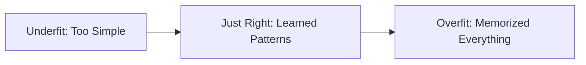

# Data Splitting: Training vs. Testing

How do we know if a model has actually **learned** anything, or if it just **memorized** the answers?

---

## Conceptual Intuition

Imagine you are studying for a math test. 
- You have a workbook with 100 practice questions and their answers at the back.
- If you just memorize those 100 answers, you might think you are a genius. 
- But when the teacher gives you a **new** question on the real test, you will fail!

To prevent this, we split our data into two main piles: **Training** and **Testing**.

---

## The Three Splits

### Training Set (~70%)
This is the "Workbook." The model looks at these questions and answers over and over again to learn the patterns.

### Validation Set (~15%)
This is the "Practice Quiz." We use this to see if the model is doing well while it is still learning. We might change the model's "knobs" (hyperparameters) based on this.

### Test Set (~15%)
This is the "Final Exam." The model is **never** allowed to see these questions until the very end. This gives us the honest truth about how good the model really is.

---

## The Golden Rule of ML

> [!CAUTION]
> **NEVER train on your test data.** 
> If the computer sees the answers to the test while it is studying, its score will be fake. This is called **Data Leakage**.

---

## Overfitting vs. Underfitting

- **Overfitting:** The model memorized the training data too well (including the noise/accidents in the data). It fails on the test set.
- **Underfitting:** The model was too lazy or too simple. It didn't even learn the patterns in the training data.

