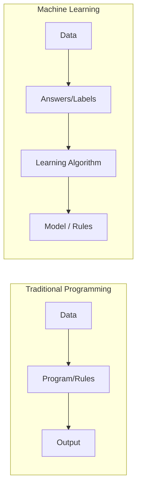
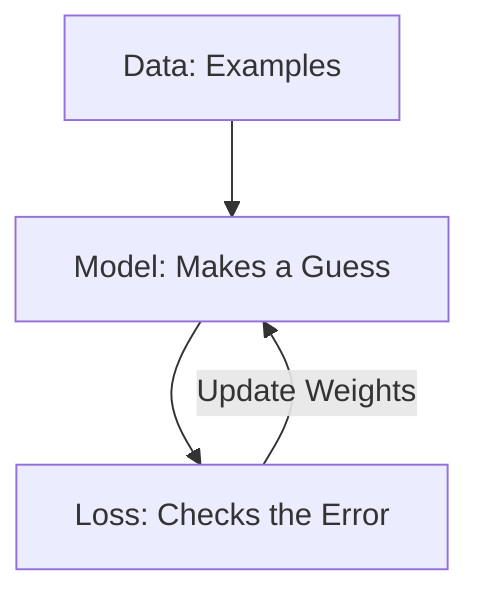

# Introduction to ML

---

> [!TIP]
> **Imagine you have a robot named Zog.** 
> Zog is very smart but doesn't know what an apple is. You could try to write a "Rule Book" for Zog:
> 1. If it's round...
> 2. And it's red...
> 3. And it has a stem...
> **THEN it is an apple.**
> 
> But what if the apple is green? Or what if it's sliced? Your rule book would fail! 
> **Machine Learning** is different. Instead of rules, you show Zog 1,000 pictures of apples. Zog looks at them and learns the "vibe" or the **pattern** of an apple by himself.

---

## The Core Definition

**Machine Learning (ML)** is a way of teaching computers to solve problems by looking at examples (data) rather than following a strict set of human-written instructions.

In the old way (**Traditional Programming**), we (humans) give the computer:
- **Data** (The information)
- **Rules** (The instructions we wrote)
- **Result** (The computer gives us the answer based on our rules)

In **Machine Learning**, we give the computer:
- **Data** (The information)
- **Answers** (Examples of what the results should look like)
- **Rules** (The computer **figures out the rules** for us!)

---

## Why is this Mathematical?

Even though Zog the Robot learns from "vibes," the computer actually uses **Math** to find those patterns. 

Every picture Zog looks at is actually a grid of numbers (pixels). Every "rule" Zog learns is actually a mathematical function.

$f(\text{Input}) = \text{Prediction}$

Our goal in ML is to find the perfect function $f$ that predicts the right answer almost every time.

---

## Example: Identifying ML

**Scenario:** You want to build a system that detects if a credit card transaction is a "theft" (fraud).

1.  **Method A:** You write a rule: "If the transaction is over $10,000 and happens at 3 AM, mark as theft."
2.  **Method B:** You give a computer 1 million past transactions. 10,000 are marked as "theft" and 990,000 are marked as "safe." The computer finds that thefts usually happen in weird locations or at weird times.

**Which one is Machine Learning?**

> [!NOTE]
> **Method B** is Machine Learning. Method A is just a human writing a rule. Method B allows the computer to find complex patterns (like "weird locations") that a human might miss.

---

To talk like a Machine Learning engineer, we need to know the specific names for the things we use. 

---

## The Building Blocks

### Features ($x$)
These are the "clues" or inputs we give to the computer. 
- **Analogy:** If you are trying to guess if a fruit is a lemon or an orange, the **features** are the *color*, the *size*, and the *weight*.
- **Math:** We usually represent features as a vector $x = [x_1, x_2, \ldots, x_d]$.

### Labels ($y$)
This is the "answer" or the output we want the computer to guess.
- **Analogy:** The **label** is the actual name of the fruit: "Lemon" or "Orange."
- **Math:** The true answer is $y$.

### Training Data
The set of examples the computer looks at to learn.
- **Math:** A dataset $D$ is a collection of pairs: $D = \{(x_i, y_i) \mid i=1 \ldots n\}$.

---

## The Learning Parts

### Model ($f$)
The "brain" of the operation. It's the mathematical function that takes the features and tries to guess the label.
- **Math:** $\hat{y} = f(x)$
- **Note:** $\hat{y}$ (read as "y-hat") means "the model's guess." We want $\hat{y}$ to be as close to $y$ as possible!

### Parameters ($w, b$)
These are the "knobs" inside the model that the computer turns to get the right answer.
- **Weights ($w$):** How much importance the model gives to each feature.
- **Bias ($b$):** A starting offset for the model.

> [!NOTE]
> **Example:** $f(x) = w \cdot x + b$
> If $w$ is large for the "color" feature, it means the model thinks color is very important for deciding if it's a lemon.

---

## Summary Table

| Term | Symbol | Intuitive Meaning |
| :--- | :--- | :--- |
| **Feature** | $x$ | The "Clue" |
| **Label** | $y$ | The "Answer" |
| **Prediction** | $\hat{y}$ | The "Guess" |
| **Weights** | $w$ | Importance of the Clue |
| **Loss** | $L$ | How wrong the guess was |

---

## Visualizing a Dataset

Imagine we are predicting if a student will pass an exam based on **Hours Studied**.

| Student | Hours ($x$) | Result ($y$) |
| :--- | :--- | :--- |
| Alice | 10 | Pass (1) |
| Bob | 2 | Fail (0) |
| Charlie | 8 | Pass (1) |

In math language, our dataset $D$ has 3 points:
$x_1=10, y_1=1$
$x_2=2, y_2=0$
$x_3=8, y_3=1$

---

Every single Machine Learning system in the world, from the one that recognizes your face to the one that drives a car, is built on three main pillars. 

---

## Pillar 1: The Data ($D$)
Data is the "Experience." Just like you need to see many cats to know what a cat looks like, the computer needs many examples.

- **Quantity:** More data is usually better.
- **Quality:** If you show the computer bad examples (like pictures of dogs labeled as cats), it will learn the wrong things! (This is called **Garbage In, Garbage Out**).

---

## Pillar 2: The Model ($f(x, w)$)
The Model is the "Formula." It's the engine that takes the data and makes a guess.

The most famous simple model is the **Linear Model**:
$f(x) = w \cdot x + b$

- **$w$ (Weight):** Think of this as the "Importance." If $w$ is high, $x$ matters a lot.
- **$b$ (Bias):** Think of this as the "Starting Point."

---

## Pillar 3: The Loss Function ($L$)
The Loss is the "Scorecard." It tells the computer exactly how wrong it is.

> [!IMPORTANT]
> **The Goal of ML:** We want to find the weights ($w$) and bias ($b$) that make the **Loss as small as possible.** 
> This is called **Optimization**.

### How do we calculate Loss?
One common way is the **Squared Error**:
$L = (y - \hat{y})^2$

- If the real answer $y = 10$ and the guess $\hat{y} = 10$, then $Loss = (10 - 10)^2 = 0$. (Perfect!)
- If the real answer $y = 10$ and the guess $\hat{y} = 2$, then $Loss = (10 - 2)^2 = 64$. (Ouch! Big error!)

---

## Putting it all together: The Training Loop

1.  **Predict:** The model makes a guess ($\hat{y}$).
2.  **Calculate Loss:** See how far off the guess was from the truth ($y$).
3.  **Update:** Change the weights ($w$) a tiny bit to make the Loss smaller next time.
4.  **Repeat:** Do this thousands of times until the model stops making mistakes.

---

## Why Squared Error?
Why do we square the difference?
1.  **It removes negatives:** Whether you guess 5 too high or 5 too low, the error should be positive ($5^2 = 25$ and $(-5)^2 = 25$).
2.  **It punishes big mistakes:** Squaring a large number makes it huge! ($2^2 = 4$, but $10^2 = 100$). This forces the computer to focus on fixing the big errors first.

---

Just like there are different ways for humans to learn (school, practice, playing), there are three main ways for computers to learn.

---

## Supervised Learning (The Teacher)
This is like having a teacher who gives you the answers. You get a set of questions ($x$) and the correct answers ($y$).

- **Analogy:** Studying for a test with an answer key at the back of the book.
- **Example:** Predicting house prices. You have 1,000 houses with their sizes and their final sale prices.

---

## Unsupervised Learning (The Detective)
In this type, there are no "correct answers" provided. The computer just looks at a pile of data and tries to find patterns or groups.

- **Analogy:** Giving a child a box of mixed LEGOs and asking them to "sort them." The child might sort by color, or by size, or by shape.
- **Example:** Grouping customers of a store into "big spenders" and "bargain hunters" based on their shopping history.

---

## Reinforcement Learning (The Gamer)
The computer (the "Agent") learns by interacting with an environment. It gets "points" (rewards) for good actions and "loses points" (penalties) for bad ones.

- **Analogy:** Training a dog. If the dog sits, it gets a treat (+ reward). If it barks at the mailman, it gets a "No!" (- penalty).
- **Example:** A computer learning to play Chess or Super Mario.

---

## Summary Comparison

| Feature | Supervised | Unsupervised | Reinforcement |
| :--- | :--- | :--- | :--- |
| **Data** | Questions + Answers | Questions only | Actions + Rewards |
| **Goal** | Predict the answer | Find hidden patterns | Get the most points |
| **Feedback** | Immediate (Wrong/Right) | None | Delayed (Win/Loss) |

> [!NOTE]
> **Most of this handbook will focus on Supervised Learning**, as it is the foundation for most modern AI applications like image recognition and price prediction!