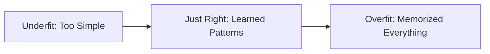

# Model Performance

---

A **Loss Function** is a way to put a number on "how bad" the model is doing. The smaller the number, the better the model.

---

## Regression Loss: Squared Error

In regression, we care about the **distance** between the guess and the truth.

$\text{Error} = y - \hat{y}$$
$$\text{Squared Error} = (y - \hat{y})^2$$

### Why square it?
1.  **Positive only:** It doesn't matter if you guessed too high or too low; the error should count against you.
2.  **Punish big errors:** If you are off by 2, your loss is 4. If you are off by 10, your loss is **100!** The model hates big mistakes and will work hard to fix them first.

---

## Classification Loss: 0/1 Loss

In classification, we use the **Indicator Function** $\mathbb{1}$.

$\text{Loss} = \mathbb{1}[\hat{y} \neq y]$$

- If $\hat{y}$ is NOT equal to $y$, the loss is **1**.
- If they are equal, the loss is **0**.

> [!TIP]
> **Accuracy vs Loss:** 
> Accuracy is "How many did I get right?" 
> Loss is "How many did I get wrong?"
> **Accuracy = 1 - Loss**

---

## Mathematical Challenge (5th Grade Math)

**Scenario:** We have 4 predictions.
- Point 1: True=10, Guess=8
- Point 2: True=5, Guess=5
- Point 3: True=2, Guess=4
- Point 4: True=1, Guess=0

**Task:** Calculate the **Mean Squared Error (MSE)**.

**Solution:**
1. Error 1: $(10-8)^2 = 2^2 = 4$
2. Error 2: $(5-5)^2 = 0^2 = 0$
3. Error 3: $(2-4)^2 = (-2)^2 = 4$
4. Error 4: $(1-0)^2 = 1^2 = 1$

**Sum of Errors:** $4 + 0 + 4 + 1 = 9$
**Mean (Average):** $9 / 4 = \mathbf{2.25}$

---

How do we know if a model has actually **learned** anything, or if it just **memorized** the answers?

---

## Conceptual Intuition

Imagine you are studying for a math test. 
- You have a workbook with 100 practice questions and their answers at the back.
- If you just memorize those 100 answers, you might think you are a genius. 
- But when the teacher gives you a **new** question on the real test, you will fail!

To prevent this, we split our data into two main piles: **Training** and **Testing**.

---

## The Three Splits

### Training Set (~70%)
This is the "Workbook." The model looks at these questions and answers over and over again to learn the patterns.

### Validation Set (~15%)
This is the "Practice Quiz." We use this to see if the model is doing well while it is still learning. We might change the model's "knobs" (hyperparameters) based on this.

### Test Set (~15%)
This is the "Final Exam." The model is **never** allowed to see these questions until the very end. This gives us the honest truth about how good the model really is.

---

## The Golden Rule of ML

> [!CAUTION]
> **NEVER train on your test data.** 
> If the computer sees the answers to the test while it is studying, its score will be fake. This is called **Data Leakage**.

---

## Overfitting vs. Underfitting

- **Overfitting:** The model memorized the training data too well (including the noise/accidents in the data). It fails on the test set.
- **Underfitting:** The model was too lazy or too simple. It didn't even learn the patterns in the training data.

---

This is a special way of building a model that is very useful for **compressing** information and **finding patterns**.

---

## Conceptual Intuition

Imagine you want to send a secret message to your friend, but you only have a tiny piece of paper.
1.  **The Encoder:** You take a long sentence ("The giant fluffy cat sat on the blue mat") and turn it into a tiny code ("GFC-BM").
2.  **The Code:** This is the small, compressed version.
3.  **The Decoder:** Your friend takes the code ("GFC-BM") and tries to turn it back into the original long sentence.

If your friend can get the sentence right, it means your code was very good at capturing the important parts!

---

## Mathematical Structure

We have two functions working together:
- **Encoder ($f$):** Turns high-dimensional data into a low-dimensional "code" $z$.
- **Decoder ($g$):** Turns the code $z$ back into the original data.

$z = f(x)$
$$\hat{x} = g(z)$$

### The Goal
We want $\hat{x}$ to be as close to the original $x$ as possible. 

$$\text{Reconstruction Loss} = \|x - \hat{x}\|^2$$

---

## Why do we do this?

If a computer can compress a high-resolution image of a face into just 10 numbers and then reconstruct the face perfectly, those 10 numbers must represent the **most important parts** of a face (like eye color, nose shape, etc.).

This is a powerful way to do **Unsupervised Learning**!

---

## Example Case

**Scenario:** You have a dataset of 1,000-word essays. You want to compress them into 10-word summaries.
1. What is the **Encoder's** job?
2. What is the **Decoder's** job?
3. What happens if the summary is only 1 word?

**Solution:**
1. **Encoder:** Read the long essay and write the 10-word summary.
2. **Decoder:** Read the 10-word summary and try to rewrite the original essay.
3. **If 1 word:** The information is too small (too compressed). The Decoder will likely fail to reconstruct the essay, and the **Loss** will be very high.