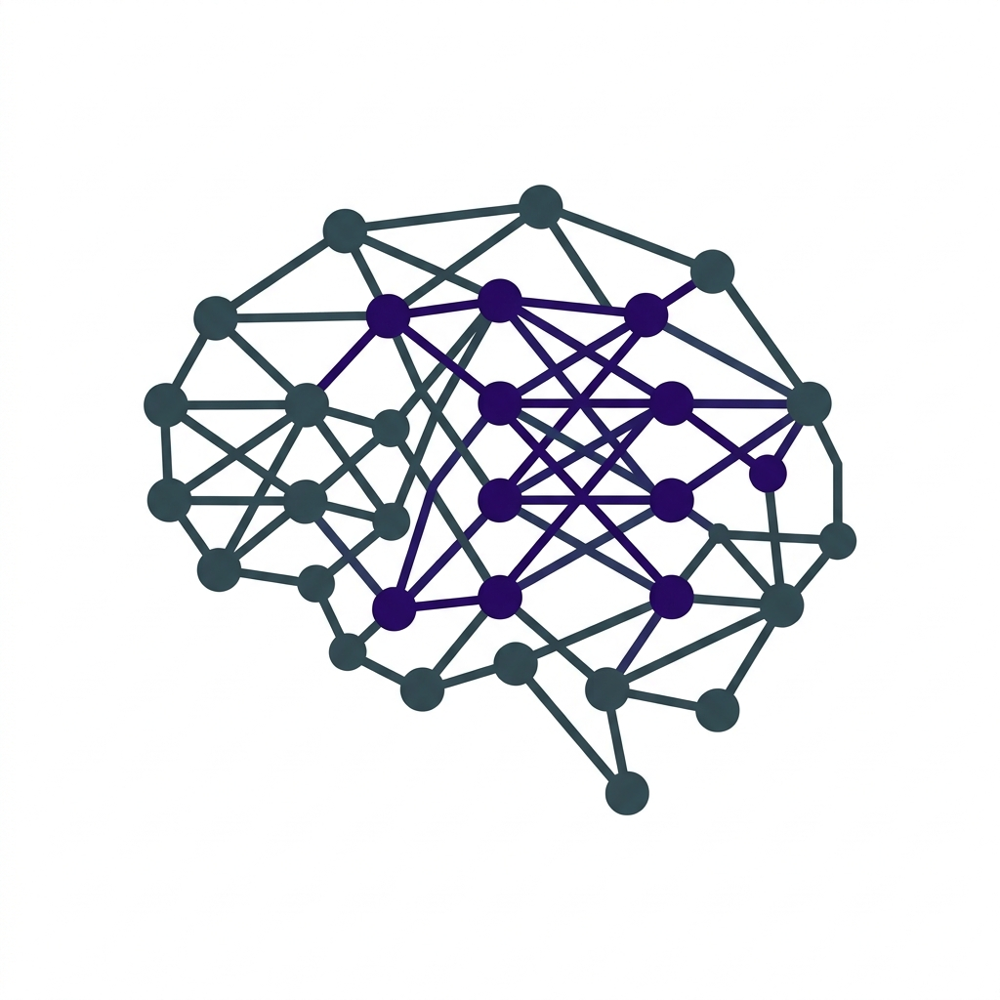

# Machine Learning Foundations Handbook 🧠

> A high-fidelity, interactive pedagogical handbook covering the core mathematical and theoretical foundations of Machine Learning.



## 📖 Overview

This handbook is designed as a sophisticated single-page application (SPA) to provide a seamless, textbook-quality learning experience. It bridges the gap between abstract mathematical theory and practical machine learning implementation, following a **Cyber-Minimalist** aesthetic that prioritizes content density and readability.

The project standardizes complex theoretical concepts across 12 intensive modules, ensuring that every derivation—from Multivariable Calculus to Spectral Theory—is presented with maximum clarity.

## ✨ Key Features

- **Cyber-Minimalist Design System**: A premium, distraction-free interface built on a Slate-based color palette with glassmorphism effects and fluid typography.
- **Standardized Formula Boxes**: Every critical mathematical theorem and identity is encased in high-fidelity "Formula Boxes" for consistent visual emphasis.
- **Safe-Injection Rendering**: A custom DOM-based pipeline that ensures LaTeX formulas and SVG visualizations render without backslash-stripping or corruption.
- **Technical Video Integration**: Context-aware links to recommended lectures (including high-quality Hindi-language resources) for deeper conceptual dives.
- **Interactive Technical Graphs**: Hand-optimized SVG visualizations for concepts like Gradient Descent convergence, Sigmoid functions, and Normal distributions.
- **Global Command Palette**: Instant, fuzzy-search navigation across the entire curriculum using `Ctrl + K`.
- **Keyboard-First Navigation**: Seamlessly toggle between topics using the `←` and `→` arrow keys.
- **Dual-Phase Scroll Logic**: Automated scroll resets ensure a consistent starting point for every new topic.

---

## 📅 Curriculum Scope

The handbook covers a comprehensive 12-week foundation:

- **Week 1-2**: Foundations of ML & Advanced Calculus
- **Week 3-5**: Linear Algebra (Least Squares, Eigenvalues, Symmetric Matrices)
- **Week 6**: SVD and Principal Component Analysis (PCA)
- **Week 7-8**: Unconstrained & Convex Optimization
- **Week 9-10**: Constrained Optimization (Lagrange, KKT) & Duality Theory
- **Week 11-12**: Probabilistic Models, Exponential Family & EM Algorithm

---

## 🛠️ Technology Stack

- **Core**: HTML5, Vanilla JavaScript (ES6+), Vanilla CSS
- **Mathematics**: [MathJax 3.0](https://www.mathjax.org/) (Configured for SVG output)
- **Content Engine**: [marked.js](https://marked.js.org/) with custom "Safe-Injection" extensions
- **Syntax Highlighting**: [Prism.js](https://prismjs.com/)
- **Icons**: [Lucide](https://lucide.dev/) for crisp, scalable UI elements

---

## 🚀 Getting Started

The handbook is a self-contained client-side application. No build tools, compilers, or local servers are required (though a Live Server extension is recommended for the best experience).

1. Clone this repository.
2. Open `index.html` in any modern web browser.

### Keyboard Shortcuts

- `←` / `→`: Next/Previous Topic
- `Ctrl + K`: Open Command Palette / Search
- `Esc`: Close Overlays / Reset Search

---

## 📂 Project Architecture

```text
├── index.html          # Main application shell and UI layout
├── book/               # Core application assets
│   ├── app.js          # SPA Logic & Safe-Injection Rendering Pipeline
│   ├── style.css       # Design System (Cyber-Minimalist Theme)
│   ├── book_data.js    # Compiled technical curriculum (Knowledge Base)
│   └── logo.png        # Handbook visual identity
├── WEEK 1 - 12/        # Source curriculum data (Raw Markdown/Python)
└── README.md           # Documentation
```

---

## ✍️ Author

**Divya Prakash** - _Primary Developer & Content Architect_

---

## 📄 License

This project is created for educational purposes. All rights reserved.
